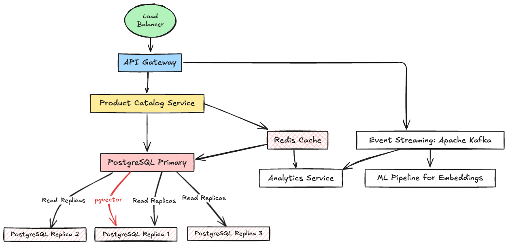
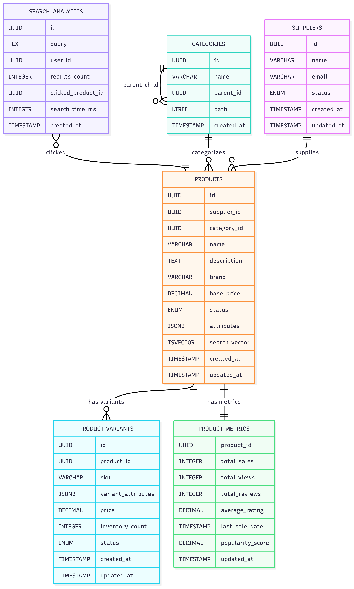

# Product Search API

A high-performance, domain-driven NestJS API for product catalog search with hybrid ranking, caching, and analytics.

## 🚀 Features

### Core Functionality

- **Hybrid Search**: Full-text search with popularity-based ranking
- **Product Catalog Management**: Products, variants, suppliers, and categories
- **Hierarchical Categories**: Tree structure with LTREE for efficient queries
- **Caching Layer**: Redis-based caching for search results and product details
- **Analytics**: Search analytics and product metrics tracking
- **Domain-Driven Architecture**: Clean separation of concerns with bounded contexts

### Search Capabilities

- **Free-text Search**: Natural language queries across product names, descriptions, and attributes
- **Attribute-based Filtering**: Filter by category, supplier, price range, etc.
- **Hybrid Ranking**: Combines text relevance (70%) and popularity (30%)
- **Pagination**: Offset-based pagination with configurable limits
- **Real-time Results**: Cached results with 5-minute TTL for performance

### Technical Features

- **TypeORM Migrations**: Database schema management with Table builder pattern
- **PostgreSQL Extensions**: pgvector, pg_trgm, ltree for advanced search
- **Docker Compose**: Complete development environment
- **Structured Logging**: Comprehensive application logging
- **Validation**: Request/response validation with class-validator
- **Error Handling**: Global exception handling and error responses

## 🏗️ Architecture



### Domain-Driven Design Structure

```
src/
├── suppliers/                    # Supplier Management Domain
│   ├── entities/
│   │   └── supplier.entity.ts
│   ├── dto/
│   │   ├── create-supplier.dto.ts
│   │   └── update-supplier.dto.ts
│   ├── services/
│   │   ├── suppliers.service.ts
│   │   └── supplier-validation.service.ts
│   ├── controllers/
│   │   └── suppliers.controller.ts
│   ├── repositories/
│   │   └── suppliers.repository.ts
│   └── suppliers.module.ts
├── categories/                   # Category Management Domain
│   ├── entities/
│   │   └── category.entity.ts
│   ├── dto/
│   │   ├── create-category.dto.ts
│   │   └── update-category.dto.ts
│   ├── services/
│   │   ├── categories.service.ts
│   │   └── category-tree.service.ts
│   ├── controllers/
│   │   └── categories.controller.ts
│   ├── repositories/
│   │   └── categories.repository.ts
│   └── categories.module.ts
├── products/                     # Core Product Domain
│   ├── entities/
│   │   ├── product.entity.ts
│   │   └── product-variant.entity.ts
│   ├── dto/
│   │   ├── create-product.dto.ts
│   │   ├── update-product.dto.ts
│   │   └── product-response.dto.ts
│   ├── services/
│   │   ├── products.service.ts
│   │   ├── product-variants.service.ts
│   │   └── product-validation.service.ts
│   ├── controllers/
│   │   ├── products.controller.ts
│   │   └── product-variants.controller.ts
│   ├── repositories/
│   │   ├── products.repository.ts
│   │   └── product-variants.repository.ts
│   └── products.module.ts
├── search/                       # Product Search Domain
│   ├── entities/
│   │   └── search-analytics.entity.ts
│   ├── dto/
│   │   ├── search-request.dto.ts
│   │   ├── search-response.dto.ts
│   │   └── search-filters.dto.ts
│   ├── services/
│   │   ├── search.service.ts
│   │   ├── search-analytics.service.ts
│   │   └── search-indexing.service.ts
│   ├── controllers/
│   │   └── search.controller.ts
│   ├── repositories/
│   │   └── search-analytics.repository.ts
│   └── search.module.ts
├── analytics/                    # Product Analytics Domain
│   ├── entities/
│   │   └── product-metrics.entity.ts
│   ├── dto/
│   │   ├── metrics-request.dto.ts
│   │   └── metrics-response.dto.ts
│   ├── services/
│   │   ├── product-metrics.service.ts
│   │   └── analytics-aggregation.service.ts
│   ├── controllers/
│   │   └── analytics.controller.ts
│   ├── repositories/
│   │   └── product-metrics.repository.ts
│   └── analytics.module.ts
├── common/                       # Shared Infrastructure
│   ├── cache/
│   │   ├── cache.module.ts
│   │   └── cache.service.ts
│   └── common.module.ts
├── database/                     # Database Configuration
│   ├── data-source.ts
│   ├── database.module.ts
│   ├── migration-runner.service.ts
│   └── migrations/
│       ├── 1700000000000-CreateInitialSchema.ts
│       └── 1755682059232-AddTestingData.ts
└── app.module.ts
```

### Domain Boundaries

- **SuppliersModule**: Supplier management (no dependencies)
- **CategoriesModule**: Category hierarchy (no dependencies)
- **ProductsModule**: Core product operations (depends on suppliers + categories)
- **SearchModule**: Product search functionality (depends on products + categories)
- **AnalyticsModule**: Metrics & reporting (event-driven, no direct dependencies)
- **CommonModule**: Shared infrastructure (caching, database)

## 🛠️ Technology Stack

### Backend Framework

- **NestJS**: Progressive Node.js framework with TypeScript
- **TypeScript**: Type-safe JavaScript development

### Database & ORM

- **PostgreSQL**: Primary database with advanced extensions
- **TypeORM**: Object-Relational Mapping with migration support
- **pgvector**: Vector similarity search extension
- **pg_trgm**: Trigram matching for fuzzy search
- **ltree**: Hierarchical tree structures

### Caching & Performance

- **Redis**: In-memory data store for caching
- **cache-manager**: Caching abstraction layer
- **cache-manager-redis-store**: Redis store implementation

### Validation & Serialization

- **class-validator**: Decorator-based validation
- **class-transformer**: Object transformation and serialization

### Development Tools

- **Docker & Docker Compose**: Containerization and orchestration
- **TypeORM CLI**: Database migration management
- **ESLint**: Code linting and formatting

## 📋 Prerequisites

- **Node.js**: v18 or higher
- **Docker**: v20 or higher
- **Docker Compose**: v2 or higher
- **npm**: v8 or higher

## 🚀 Quick Start

### 1. Clone and Setup

```bash
git clone <repository-url>
cd product-search-api
npm install
```

### 2. Environment Configuration

Create a `.env` file in the root directory:

```env
# Database Configuration
DB_HOST=localhost
DB_PORT=5432
DB_USERNAME=postgres
DB_PASSWORD=password
DB_DATABASE=product_catalog

# Redis Configuration
REDIS_HOST=localhost
REDIS_PORT=6379

# Application Configuration
PORT=3000
NODE_ENV=development
```

### 3. Start Services

```bash
# Start all services (PostgreSQL, Redis, NestJS app)
docker-compose up -d

# Run database migrations
npm run migration:run

# Check application status
docker-compose logs app
```

### 4. Verify Installation

```bash
# Test the API health
curl http://localhost:3000/api/v1/suppliers

# Test search functionality
curl "http://localhost:3000/api/v1/search?query=iPhone"
```

## 📊 Database Schema



### Core Tables

- **suppliers**: Supplier information and status
- **categories**: Hierarchical category structure with LTREE paths
- **products**: Product catalog with search vectors and embeddings
- **product_variants**: Product variants with SKU and inventory
- **product_metrics**: Analytics data for ranking and popularity
- **search_analytics**: Search query tracking and performance metrics

### Key Features

- **UUID Primary Keys**: Globally unique identifiers
- **Full-text Search**: PostgreSQL tsvector with triggers
- **Hierarchical Categories**: LTREE for efficient tree queries
- **JSONB Attributes**: Flexible product and variant attributes
- **GIN Indexes**: Optimized for JSONB and full-text search

## 🔧 Development Commands

### Database Migrations

```bash
# Generate new migration
npm run migration:generate -- src/database/migrations/MigrationName

# Create empty migration
npm run migration:create -- src/database/migrations/MigrationName

# Run pending migrations
npm run migration:run

# Revert last migration
npm run migration:revert

# Show migration status
npm run migration:show
```

### Application Development

```bash
# Development mode with hot reload
npm run start:dev

# Production build
npm run build

# Production start
npm run start:prod

# Linting
npm run lint

# Type checking
npm run type-check
```

### Docker Commands

```bash
# Start all services
docker-compose up -d

# Rebuild and start
docker-compose up -d --build

# View logs
docker-compose logs app
docker-compose logs postgres
docker-compose logs redis

# Stop all services
docker-compose down

# Remove volumes (clean slate)
docker-compose down -v
```

## 📡 API Endpoints

### Base URL

```
http://localhost:3000/api/v1
```

### Suppliers API

```bash
# Get all suppliers
GET /suppliers

# Get supplier by ID
GET /suppliers/:id

# Create supplier
POST /suppliers
Content-Type: application/json

{
  "name": "New Supplier",
  "email": "supplier@example.com",
  "status": "active"
}

# Update supplier
PUT /suppliers/:id
Content-Type: application/json

{
  "name": "Updated Supplier",
  "email": "updated@example.com"
}

# Delete supplier
DELETE /suppliers/:id
```

### Categories API

```bash
# Get all categories
GET /categories

# Get category by ID
GET /categories/:id

# Get category tree
GET /categories/tree

# Create category
POST /categories
Content-Type: application/json

{
  "name": "New Category",
  "parentId": "optional-parent-uuid"
}

# Update category
PUT /categories/:id
Content-Type: application/json

{
  "name": "Updated Category",
  "parentId": "new-parent-uuid"
}

# Delete category
DELETE /categories/:id
```

### Products API

```bash
# Get all products
GET /products

# Get product by ID
GET /products/:id

# Create product
POST /products
Content-Type: application/json

{
  "name": "New Product",
  "description": "Product description",
  "brand": "Brand Name",
  "basePrice": 99.99,
  "supplierId": "supplier-uuid",
  "categoryId": "category-uuid",
  "attributes": {
    "color": "Red",
    "size": "Large"
  }
}

# Update product
PUT /products/:id
Content-Type: application/json

{
  "name": "Updated Product",
  "basePrice": 149.99
}

# Delete product
DELETE /products/:id
```

### Search API

```bash
# Basic search
GET /search?query=iPhone

# Search with filters
GET /search?query=laptop&categoryId=category-uuid&minPrice=1000&maxPrice=3000

# Search with pagination
GET /search?query=shirt&limit=10&offset=20

# Search with sorting
GET /search?query=electronics&sortBy=price&sortOrder=desc

# Complex search example
GET /search?query=wireless headphones&categoryId=electronics-uuid&supplierId=techcorp-uuid&minPrice=200&maxPrice=500&limit=5
```

### Product Variants API

```bash
# Get variants for product
GET /products/:productId/variants

# Create variant
POST /products/:productId/variants
Content-Type: application/json

{
  "sku": "PROD-VAR-001",
  "variantAttributes": {
    "color": "Blue",
    "size": "Medium"
  },
  "price": 89.99,
  "inventoryCount": 100
}

# Update variant
PUT /products/:productId/variants/:variantId
Content-Type: application/json

{
  "price": 79.99,
  "inventoryCount": 150
}

# Delete variant
DELETE /products/:productId/variants/:variantId
```

## 🧪 Testing Examples

### Search Functionality Tests

```bash
# Test basic search
curl -X GET "http://localhost:3000/api/v1/search?query=iPhone" \
  -H "Content-Type: application/json"

# Test category-specific search
curl -X GET "http://localhost:3000/api/v1/search?query=laptop&categoryId=07840073-c5fa-4d7f-98b6-34a81af012d0" \
  -H "Content-Type: application/json"

# Test price range search
curl -X GET "http://localhost:3000/api/v1/search?query=electronics&minPrice=100&maxPrice=1000" \
  -H "Content-Type: application/json"

# Test pagination
curl -X GET "http://localhost:3000/api/v1/search?query=shirt&limit=3&offset=0" \
  -H "Content-Type: application/json"

# Test supplier-specific search
curl -X GET "http://localhost:3000/api/v1/search?query=smartphone&supplierId=51e6172d-6207-4390-bd06-574fafa19487" \
  -H "Content-Type: application/json"
```

### CRUD Operations Tests

```bash
# Create a new supplier
curl -X POST "http://localhost:3000/api/v1/suppliers" \
  -H "Content-Type: application/json" \
  -d '{
    "name": "Test Supplier",
    "email": "test@supplier.com",
    "status": "active"
  }'

# Create a new category
curl -X POST "http://localhost:3000/api/v1/categories" \
  -H "Content-Type: application/json" \
  -d '{
    "name": "Test Category",
    "parentId": null
  }'

# Create a new product
curl -X POST "http://localhost:3000/api/v1/products" \
  -H "Content-Type: application/json" \
  -d '{
    "name": "Test Product",
    "description": "A test product for API testing",
    "brand": "TestBrand",
    "basePrice": 99.99,
    "supplierId": "supplier-uuid-here",
    "categoryId": "category-uuid-here",
    "attributes": {
      "color": "Test Color",
      "material": "Test Material"
    }
  }'
```

### Category Tree Tests

```bash
# Get full category tree
curl -X GET "http://localhost:3000/api/v1/categories/tree" \
  -H "Content-Type: application/json"

# Get categories by parent
curl -X GET "http://localhost:3000/api/v1/categories?parentId=2fd61b7f-992d-4da9-8906-828d6a64ae7e" \
  -H "Content-Type: application/json"
```

## 📈 Search Ranking Algorithm

### Hybrid Ranking Formula

```
Final Score = (0.7 × Text Rank) + (0.3 × Popularity Score)
```

### Components

1. **Text Rank (70%)**: PostgreSQL full-text search relevance
   - Matches against product name, description, brand, and attributes
   - Uses weighted tsvector with triggers for real-time updates

2. **Popularity Score (30%)**: Normalized popularity metrics
   - Based on total sales, views, reviews, and average rating
   - Normalized to 0-1 scale for consistent ranking

### Example Ranking

```json
{
  "id": "7a5839f1-d9b3-463b-a9cf-e10998665f77",
  "name": "iPhone 15 Pro Max",
  "score": 1.0,
  "metrics": {
    "totalSales": 500,
    "popularityScore": "0.9500"
  }
}
```

## 🔄 Caching Strategy

### Cache Layers

1. **Search Results**: 5-minute TTL for frequent queries
2. **Product Details**: 1-hour TTL for product information
3. **Supplier/Category Data**: 30-minute TTL for reference data

### Cache Keys

- Search: `search:${queryHash}:${filtersHash}`
- Product: `product:${productId}`
- Supplier: `supplier:${supplierId}`
- Category: `category:${categoryId}`

### Cache Invalidation

- Product updates invalidate product cache and related search caches
- Supplier/Category updates invalidate respective caches
- Manual cache reset available via API

## 📊 Monitoring & Observability

### Logging

- Structured logging with correlation IDs
- Request/response logging for debugging
- Error tracking with stack traces
- Performance metrics logging

### Health Checks

```bash
# Application health
curl http://localhost:3000/health

# Database connectivity
curl http://localhost:3000/health/db

# Redis connectivity
curl http://localhost:3000/health/redis
```

### Metrics (Future Enhancement)

- Prometheus metrics endpoint
- Grafana dashboards
- Search performance metrics
- Cache hit/miss ratios

## 🚀 Deployment

### Production Environment

```bash
# Build production image
docker build -t product-search-api:latest .

# Run with production environment
docker run -d \
  -p 3000:3000 \
  -e NODE_ENV=production \
  -e DB_HOST=production-db \
  -e REDIS_HOST=production-redis \
  product-search-api:latest
```

### Environment Variables

```env
# Required
NODE_ENV=production
DB_HOST=your-db-host
DB_PORT=5432
DB_USERNAME=your-db-user
DB_PASSWORD=your-db-password
DB_DATABASE=your-db-name
REDIS_HOST=your-redis-host
REDIS_PORT=6379

# Optional
PORT=3000
LOG_LEVEL=info
CACHE_TTL=300
```

## 🔧 Configuration

### Application Config

```typescript
// src/config/configuration.ts
export default () => ({
  port: parseInt(process.env.PORT, 10) || 3000,
  database: {
    host: process.env.DB_HOST,
    port: parseInt(process.env.DB_PORT, 10) || 5432,
    username: process.env.DB_USERNAME,
    password: process.env.DB_PASSWORD,
    database: process.env.DB_DATABASE,
  },
  redis: {
    host: process.env.REDIS_HOST,
    port: parseInt(process.env.REDIS_PORT, 10) || 6379,
  },
  cache: {
    ttl: parseInt(process.env.CACHE_TTL, 10) || 300,
  },
});
```

## 🤝 Contributing

### Development Workflow

1. Fork the repository
2. Create a feature branch: `git checkout -b feature/amazing-feature`
3. Make your changes following the coding standards
4. Add tests for new functionality
5. Run the test suite: `npm test`
6. Commit your changes: `
